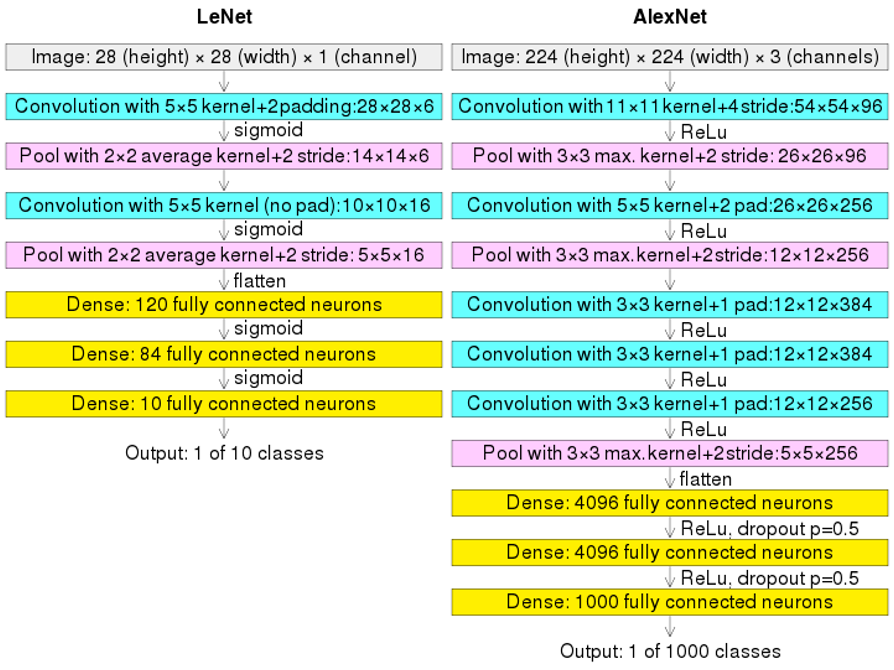

# Laboratorium 4 - konwolucyjne sieci neuronowe
Opracowanie do wejściówki

### 1. Operacja konwolucji (splotu).
Operacja konwolucji to przekształcenie macierzowe fragmentów zdjęcia mające na celu wydobycie informacji o cechach obrazu. Mamy do każdej warstwy przypisany filtr,który może być także trenowany, o określonej wielkości. Ten filtr przesuwany jest po całym obrazie wydobywając pewne cechy, korzystając z pewnej funkcji.

### 2. Warstwa konwolucyjna w sieci neuronowej.

### 3. Warstwa poolingowa.
Służy do zmniejszenia rozmiaru obrazu, zmniejszając zarazem liczbę parametrów do wytrenowania. Polling polega na łączeniu informacji o kilku pikselach w jeden piksel. Piksele grupujemy w obszary, np. $2 \times 2$ lub $3 \times 3$, a następnie stosujemy pewną, wcześniej określoną funkcję dla każdej grupy pikseli. W odróżnieniu od filtrów każdy piksel wejściowy używany jest tylko jeden raz. Zazwyczaj stosowana jest funkcja $max$ bądź średnia ze wszystkich pikseli.

### 4. Budowa typowej sieci konwolucyjnej (np. LeNet).
Zazwyczaj składa się z kilku warstw: konwolucyjnych, poollingowych a na końcu znajdują się warstwy gęste, które odpowiadają za rzeczywistą analizę obrazów. Warstw konwolucyjne i poolingowe, zazwyczaj występują po sobie, ale może być kilka warstw konwolucyjnych jedna po drugiej. Mogą mieć także różne rozmiary.

### 5. Detekcja obiektów.
Za pomocą konwolucyjnych sieci neuronowych jesteśmy w stanie z wysoką wydajnością rozponznawać obiekty. W porównaniu do MLP, gdzie tworząc warstwy dla macierzy pojedynczych pikseli, sieć połączeń potrafi być naprawdę duża, dodatkowo sieci MLP nie radzą sobie ze zmianą położenia obiektu.

### 6. Wybór bounding-boxów, kandydatury, confidence levels.
Bounding-boxy wybieramy w zależności od problematyki, dla której konstruujemy model. Ogólnymi zasadami przy ich wyborze są: konsekwencja i jak najbardziej dokładne dopasowanie ich granic (tak, aby zminimalizować niepotrzebny szum).

### 7. Fine-tuning i pre-trening, wykorzystywanie gotowych sieci.
Fine-tuning to przeniesienie uczenia w postaci określenia wag innego przetrenowanego już modelu, korzystając z nowego zbioru danych, może być przeprowadzony na całej sieci neoronowej lub jej podzbiorze. Sieć, która została wykorzystana do obliczenia początkowych wag użytych w drugim treningu jest siecią pre-treningową. Do takiego tuningu można także skorzystać z gotowych już sieci neuronowych, które realizują podobne zadanie.
